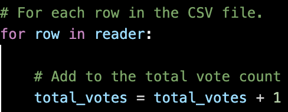
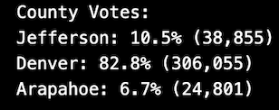
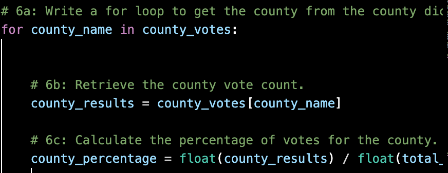
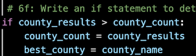
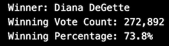
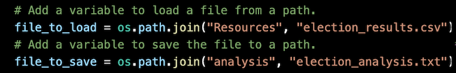
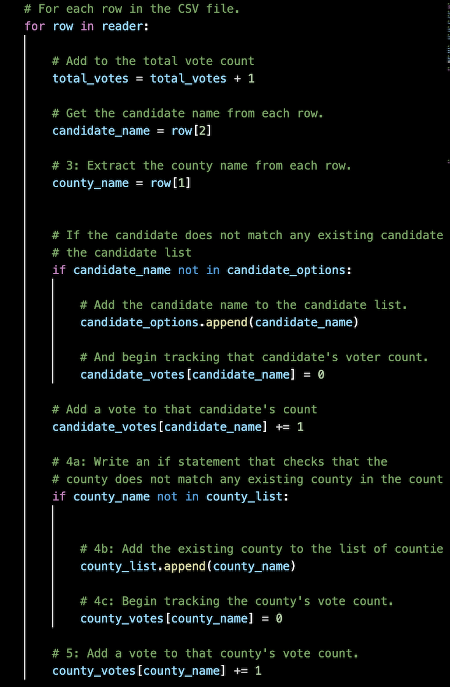

# Decision Day in Colorado

## Overview of Election Audit
The purpose of this election audit is to help Seth and Tom certify the results of the election in Colorado. To make sure that the election results are accurate, I will analyze the voting data in a Comma Separated Values file by writing Python script to display the number of votes and the percetange of votes for each candidate as well as the winning candidate. Additionally, I will breakdown the results for Jefferson, Denver, and Arapahoe counties to show the total votes and percentage of votes for each county and pinpoint which county had the highest turnout. Breaking down the results in this way may even help plan elections in the future.

---
## Results
* The total number of votes in the congressional election was 369,711.

    To get the total votes of the election, I used a vote incrementer when iterating through each row:

    
---
* Breakdown of the votes by county:  

    Jefferson County had **10.5%** of the vote with **38,855**  
    Denver County had **82.8%** of the vote with **306,055**   
    Arapahoe County had **6.7%** of the vote with **24,801**

    

    After iterating through each row of election data, to obtain the votes for each county I used a for loop to retrieve the votes from the *county_votes* dictionary and then divided the votes by the total votes to calculate the vote percentage for each county:

      
---
* Denver County had by far the most amount of votes with **306,055**, almost 8 times more than Jefferson County.

    Comparing each county total in the *county_votes* dictionary to the largest county voter tournout variable allows me to obtain the county with largest voter turnout:

    
---
* Breakdown of the votes by candidate:

    Charles Casper Stockham had **23%** of the vote with **85,213**    
    Diana DeGette had **73.8%** of the vote with **272,892**    
    Raymon Anthony Doane had **3.1%** of the vote with **11,606** 

    
---
* Diana DeGette won the election with **73.8%** of the vote and **272,892** votes:

    

---
## Summary
The Python script used in this analysis is very flexible and can be used in many different types of elections. By ammending the script, I can read different files of election data as well as breakdown the results of elections further: 

### 1. Using Different Files
Perhaps the most useful part of the script is the section that loads the Comma Separated Values file with the election data:

In the first line, I initialized a variable called *file_to_load* that will allow me to load any Comma Separated Values file and interact with it using Python. Therefore, if I had a file with election results from California called *california_governor_race.csv*, I could enter the name of that file in place of *election_results.csv* and run the audit of that election using the same script used to audit the election in Colorado. This method allows me to use Comma Separated Values files from many different types of elections and run the analysis of those elections. After running my analysis, I can then write the results to *california_gorvernor_analysis.txt* using the *txt_file.write* command just like I did with the *election_analysis.txt* file to display the audit in an easy-to-read format.

---
### 2. Breaking Down Election Results
If I had a data file with more specific election results, I can ammend the script to breakdown the election further. The *election_results.csv* file only had 3 columns: *ballot id*, *county*, and *candidate*. An analysis of this file can only really be performed on *county* and *candidate* as I did in my own analysis:

In this script, I used a for loop to iterate over all the rows and then used conditionals to tally up the vote in each row for a specific candidate and from a specific county to get the total votes for each candidate and the total votes from each county after all the rows have been looped over. 

However, a file with more information could be analyzed further. If I had information from specific cities or even specific precincts in my data file, I could change my script to include analysis of that data. I could replace the *candidate_votes* and *county_votes* dictionaries with *city_votes* and *precinct_votes* dictionaries to get a more detailed view of the voting patterns in the election. This type of information can be calculated for any election and it would be extremely useful in planning out future elections in terms of making decisions such as where to put more polling places and where to have more poll workers available.   